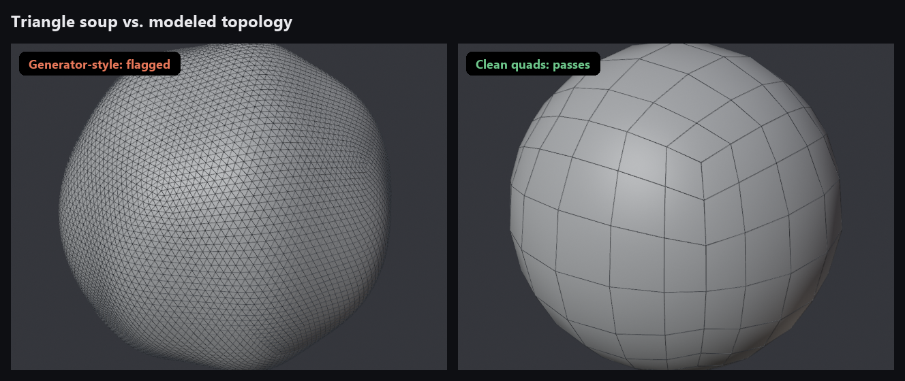
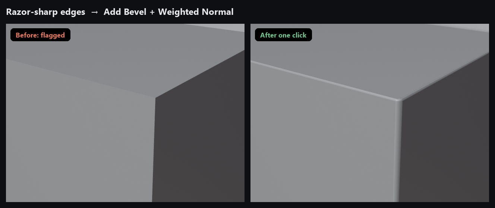
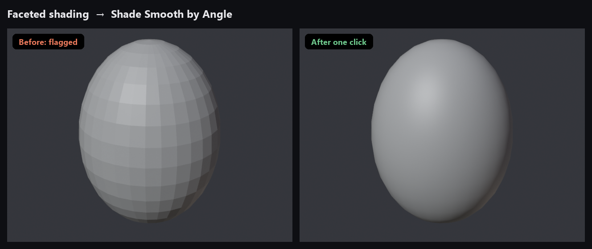
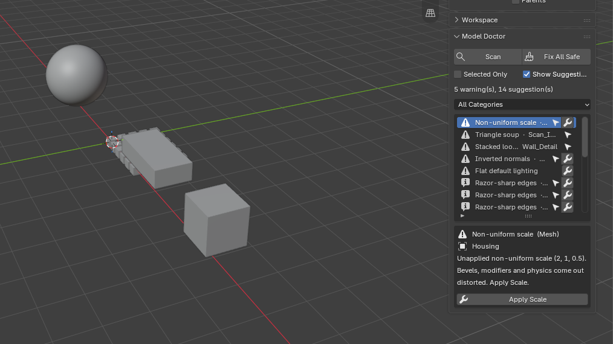
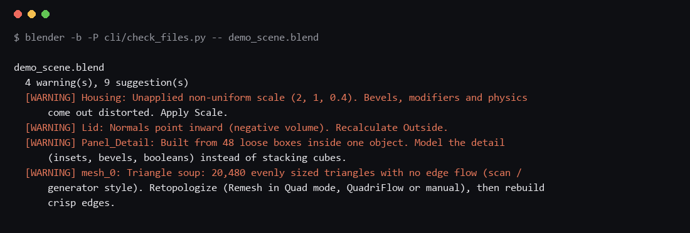

# Mesh Doctor

**A health check for your 3D models.** It catches the things that make a model look generated, scripted or unfinished, explains each one, and fixes the safe ones in a click.

Works in **Blender** (add-on and batch scanner) and **Fusion** (script).



## What it catches

| Check | Level | One-click fix |
|---|---|---|
| Triangle soup (dense, uniform triangles with no edge flow) | Warning | – |
| Detail built from stacks of loose boxes | Warning | – |
| Scene made mostly of raw 8-vertex boxes | Warning | – |
| Non-manifold edges | Warning | – |
| Inverted normals | Warning | Recalculate Outside |
| Non-uniform or mirrored scale | Warning | Apply Scale (children stay put) |
| Razor-sharp edges with no bevel | Suggestion | Bevel + Weighted Normal |
| Faceted (flat-shaded) curved surfaces | Suggestion | Shade Smooth by Angle |
| No UV map | Suggestion | Smart UV Project |
| Overlapping vertices | Suggestion | Merge by Distance |
| Fully triangulated, very heavy, unapplied uniform scale | Suggestion | Apply Scale |
| Default or generator names (`Cube.014`, `mesh_0`, `tripo_…`) | Suggestion | – |
| Generator scripts left in the file | Suggestion | – |





**Fix All Safe** applies only the fixes that don't change the look: normals, scale and smooth shading. Bevels, UVs and merging are left for you to decide.

For the reasoning behind each check, read **[The tells](docs/tells.md)**. For a full pre-share pass, use the **[Polish checklist](docs/checklist.md)**.

## Blender add-on

Requires **Blender 4.2 or newer** (tested on 5.0 and 5.2).

1. Download `mesh_doctor-<version>.zip` from [Releases](../../releases), or build it with `python build.py`.
2. **Edit → Preferences → Get Extensions → ⌄ → Install from Disk…** and pick the zip.
3. In the 3D viewport press `N`, open the **Mesh Doctor** tab, and click **Scan**.



Click a row to read the details. The arrow button selects the object, and the wrench applies the fix. Everything is undoable with `Ctrl+Z`.

## Batch scanner

Check whole folders without opening them. Files are opened read-only and never saved.

```
blender -b --factory-startup -P cli/check_files.py -- path/to/models [--all] [--json report.json]
```



It reads `.blend`, `.obj`, `.fbx`, `.glb`, `.gltf` and `.stl`, and exits with code 1 if anything got a warning, so it can be used in CI.

## Fusion script

Checks the open design for unconstrained sketches, mesh bodies, missing fillets and chamfers, missing user parameters, direct-modeling mode and default names. It is read-only.

1. **Utilities → Add-Ins → Scripts and Add-Ins → +**, and choose the `fusion/MeshDoctor` folder.
2. Select **MeshDoctor** and click **Run**.

> The Fusion script is new. Every API call it makes is checked against [Autodesk's Fusion API reference](https://help.autodesk.com/cloudhelp/ENU/Fusion-360-API/files/fusion_Sketch_isFullyConstrained.htm), but it is less tested than the Blender add-on. Please open an issue if anything misbehaves.

## Not a verdict

These checks find habits, not authors. Game assets are often triangulated, scans are dense, and blockouts are made of boxes. Use the results as a to-do list for making a model better.

## Development

```
blender -b --factory-startup -P tests/test_mesh_doctor.py
python build.py
```

The README images are generated, not mocked up: `docs/images/render.py` renders them in Blender using Mesh Doctor's own checks and fixes (it fails if a "before" isn't flagged or an "after" isn't fixed), and `docs/images/compose.py` lays them out and captures real batch-checker output.

```
blender -b --factory-startup -P docs/images/render.py
python docs/images/compose.py path/to/blender
```

## Credits

**Research.** The checks are based on these sources; [The tells](docs/tells.md) footnotes each claim to the page it came from.

- **Liz Edwards**, interviewed by Bryant Francis in [*Game Developer*](https://www.gamedeveloper.com/art/how-devs-can-spot-ai-generated-3d-models) (2024): baked lighting, jumbled UVs, polygon budgets, blobs and welded limbs, incoherent detail.
- **Xinyi**, [Neural4D Blog](https://blog.neural4d.com/user-guide/blender-retopology-ai-3d-models/): triangle soup and edge flow, non-manifold edges, holes, Meshy and Tripo cleanup problems, and the diagnosis order in the checklist.
- **Mark Boss et al.**, Stability AI, [SF3D paper](https://arxiv.org/abs/2408.00653) (2024): Marching Cubes staircase artifacts, illumination baked into textures.
- **Meghan Harris**, [Atomic Object](https://spin.atomicobject.com/blender-scripting-with-ai/) (2025): pitfalls of AI-written Blender scripts.
- **Threedle**, [LL3M](https://github.com/threedle/ll3m): example of LLM agents building 3D assets in Blender Python.
- **Leo AI**, [hands-on review of AI-designed Fusion parts](https://www.getleo.ai/blog/claude-autodesk-fusion-3d-models-review) (2026): absolute coordinates, brittle sketches, overlapping features, missing drafts.

Everything marked **(MD)** in the docs, and all thresholds in the code, come from our own measurements.

**Built with.** [Blender](https://www.blender.org) and its Python API (`bpy`, `bmesh`) by the Blender Foundation; [NumPy](https://numpy.org) for the mesh analysis; the [Autodesk Fusion API](https://aps.autodesk.com/developer/overview/autodesk-fusion-api) for the Fusion script; [Pillow](https://python-pillow.org) for laying out the README images.

**Calibration.** Thresholds were tuned so that known-clean assets pass: CC0 models from [Poly Haven](https://polyhaven.com) and [Kenney](https://kenney.nl) were scanned as references. None of their files are included here.

## License

MIT
