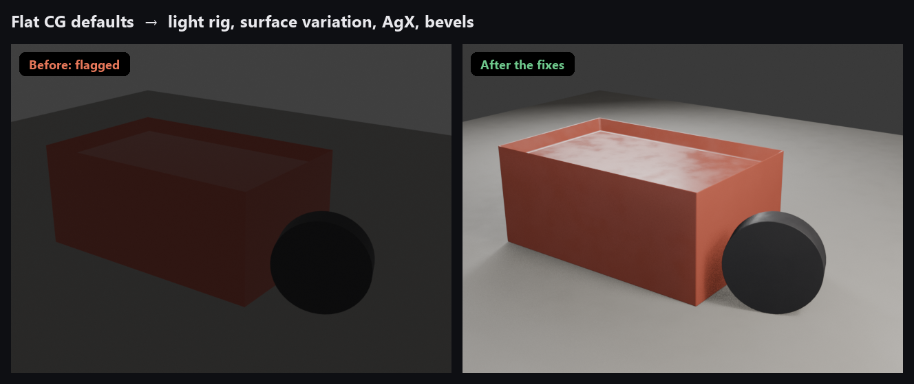

# Model Doctor

**Take AI-generated or AI-assisted 3D from "obviously generated" to finished work.**

AI output gives itself away in predictable places: triangle-soup meshes, flat plastic materials, lighting that comes from nowhere, robotic animation. Model Doctor scans your Blender scene for all of them, explains each one in plain language, and fixes what can be fixed in a click.

Works in **Blender** (add-on and batch checker) and **Fusion** (script).



## What it checks

| Area | Checks | One-click fixes |
|---|---|---|
| **Mesh** | Triangle soup, stacked loose boxes, scenes of raw cubes, non-manifold edges, inverted normals, mirrored or non-uniform scale, razor-sharp edges, faceted shading | Recalculate normals, apply scale, bevel + weighted normal, smooth by angle |
| **UVs** | No UV map, shredded generator atlases | Smart UV Project |
| **Materials** | No material, flat single-color materials, color texture with no roughness or normal detail, lighting baked into textures, missing texture files | Add surface variation (roughness breakup, color variation, micro bump) |
| **Lighting** | No lights with a plain world, a single hard light, the harsh *Standard* color view | Key/fill/rim light rig sized to your subject, switch to AgX |
| **Camera** | The startup scene's default camera angle | – |
| **Scene** | Identical clones with zero variation, unrealistic scale, no collections | Vary rotation and scale of clones |
| **Animation** | Evenly spaced, linear keyframes | – |
| **File** | Default and generator names, leftover generator scripts | – |

Warnings are things that are clearly wrong; suggestions are things worth a look. **Fix All Safe** only applies fixes that don't change the look (normals, scale, smooth shading). Everything that changes the look is one click per item, and everything is undoable.

Lighting and camera are only judged in files with a camera, so asset files (a single tree, a rig, an imported model) aren't nagged about lighting.


For the reasoning and sources behind every check, read **[The tells](docs/tells.md)**. For a complete pass before you share, use the **[Polish checklist](docs/checklist.md)**.

## Blender add-on

Requires **Blender 4.2 or newer** (tested on 5.0 and 5.2).

1. Download `model_doctor-<version>.zip` from [Releases](../../releases), or build it with `python build.py`.
2. **Edit → Preferences → Get Extensions → ⌄ → Install from Disk…** and pick the zip.
3. In the 3D viewport press `N`, open the **Model Doctor** tab, and click **Scan**.

Filter the list by area (Mesh, Materials, Lighting…). Click a row to read the details; the arrow selects the object and the wrench applies the fix.


## Batch checker

Check whole folders without opening them. Files are opened read-only and never saved.

```
blender -b --factory-startup -P cli/check_files.py -- path/to/models [--all] [--json report.json]
```


It reads `.blend`, `.obj`, `.fbx`, `.glb`, `.gltf` and `.stl`, and exits with code 1 if anything got a warning, so it can be used in CI.

## Fusion script

Checks the open design for unconstrained sketches, mesh bodies, missing fillets and chamfers, every body sharing one default appearance or material, missing user parameters, direct-modeling mode, and default names on bodies, sketches and features. It is read-only.

1. **Utilities → Add-Ins → Scripts and Add-Ins → +**, and choose the `fusion/ModelDoctor` folder.
2. Select **ModelDoctor** and click **Run**.

> The Fusion script is new. Every API call it makes is checked against [Autodesk's Fusion API reference](https://help.autodesk.com/cloudhelp/ENU/Fusion-360-API/files/fusion_Sketch_isFullyConstrained.htm), but it is less tested than the Blender add-on. Please open an issue if anything misbehaves.

## What it is and isn't

Model Doctor improves the work: topology, materials, lighting, motion. It doesn't strip metadata or hide where a model came from, and it isn't a detector. If a marketplace or contest asks you to disclose AI use, disclose it.

The checks find habits, not authors. Game assets are often triangulated, scans are dense, and blockouts are made of boxes. Use the results as a to-do list.

## Development

```
blender -b --factory-startup -P tests/test_model_doctor.py
python build.py
```

The README images are generated, not mocked up: `docs/images/render.py` renders them in Blender using Model Doctor's own checks and fixes (it fails if a "before" isn't flagged or an "after" isn't fixed), and `docs/images/compose.py` lays them out and captures real batch-checker output.

```
blender -b --factory-startup -P docs/images/render.py
python docs/images/compose.py path/to/blender
```

## Credits

**Research.** The checks are based on these sources; [The tells](docs/tells.md) footnotes each claim to the page it came from.

- **Liz Edwards**, interviewed by Bryant Francis in [*Game Developer*](https://www.gamedeveloper.com/art/how-devs-can-spot-ai-generated-3d-models) (2024): baked lighting, projected textures, jumbled UVs, polygon budgets, blobs and welded limbs, incoherent detail.
- **Xinyi**, [Neural4D Blog](https://blog.neural4d.com/user-guide/blender-retopology-ai-3d-models/): triangle soup and edge flow, non-manifold edges, holes, Meshy and Tripo cleanup problems, and the diagnosis order in the checklist.
- **Mark Boss et al.**, Stability AI, [SF3D paper](https://arxiv.org/abs/2408.00653) (2024): Marching Cubes staircase artifacts, illumination baked into textures.
- **Meghan Harris**, [Atomic Object](https://spin.atomicobject.com/blender-scripting-with-ai/) (2025): pitfalls of AI-written Blender scripts.
- **Threedle**, [LL3M](https://github.com/threedle/ll3m): example of LLM agents building 3D assets in Blender Python.
- **Leo AI**, [hands-on review of AI-designed Fusion parts](https://www.getleo.ai/blog/claude-autodesk-fusion-3d-models-review) (2026): absolute coordinates, brittle sketches, overlapping features, missing drafts.
- **Blender Manual**, [Color Management](https://docs.blender.org/manual/en/4.2/render/color_management.html): what the Standard and AgX view transforms do.
- **Wikipedia**, [Three-point lighting](https://en.wikipedia.org/wiki/Three-point_lighting) (the light-rig fix follows it) and [Twelve basic principles of animation](https://en.wikipedia.org/wiki/Twelve_basic_principles_of_animation), after Ollie Johnston and Frank Thomas, *The Illusion of Life* (1981).

Everything marked **(MD)** in the docs, and all thresholds in the code, come from our own measurements.

**Built with.** [Blender](https://www.blender.org) and its Python API (`bpy`, `bmesh`) by the Blender Foundation; [NumPy](https://numpy.org) for the mesh analysis; the [Autodesk Fusion API](https://aps.autodesk.com/developer/overview/autodesk-fusion-api) for the Fusion script; [Pillow](https://python-pillow.org) for laying out the README images.

**Calibration.** Thresholds were tuned so that known-clean assets pass with zero warnings: CC0 models from [Poly Haven](https://polyhaven.com) and [Kenney](https://kenney.nl) were scanned as references. None of their files are included here.

## License

MIT
